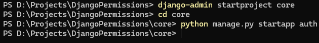

# Django Basics

## Contains
    1. How to create Basic Django Project
        - Creating Projects (C001)
        - Creating Apps (C001)
        - Configuring Apps (C001)
        - Adding Templates (C001)
        - Configuring Templates (C001)


## Commit History

### Commit-C000: "Github Initialization"

### Commit-C001: "BoilerPlate set-up"

1. Here are the initial steps
    - 1. Install Django `pip install django`
    - 2. Make sure pip is added to environmental variables. Guess that's it your good to go.
2. Create Django Project with the command `django-admin startproject <projectName>` in our case it'll be `django-admin startproject core`
3. Create Django Application by Changing Directory "cd" to the project directory `cd <projectName>` in our case it'll be `cd core` then the command to create an Django Application is `python manage.py startapp <appName>` in our case it'll be `python manage.py startapp auth`

4. Configuring the App in the Project. Navigate to `settings.py` inside the Project folder. `core\settings.py` and find 
```python
INSTALLED_APPS = [
    'django.contrib.admin',
    'django.contrib.auth',
    'django.contrib.contenttypes',
    'django.contrib.sessions',
    'django.contrib.messages',
    'django.contrib.staticfiles',
]
```
add the App name inside the `INSTALLED_APPS` list
```python
INSTALLED_APPS = [
    'django.contrib.admin',
    'django.contrib.auth',
    'django.contrib.contenttypes',
    'django.contrib.sessions',
    'django.contrib.messages',
    'django.contrib.staticfiles',

    'auth', #Django Application Name
]
```
5. Adding Templates. Create a folder `pages` or anything you want to name it. `templates` or `themes`. Add your html files inside this new folder. You can even add more folders inside this folder.
6. Configuring Templates. Go to `settings.py` inside Project folder and navigate
```python
TEMPLATES = [
    {
        'BACKEND': 'django.template.backends.django.DjangoTemplates',
        'DIRS': [],
        'APP_DIRS': True,
        'OPTIONS': {
            'context_processors': [
                'django.template.context_processors.debug',
                'django.template.context_processors.request',
                'django.contrib.auth.context_processors.auth',
                'django.contrib.messages.context_processors.messages',
            ],
        },
    },
]
```
Add
```python
import os
```
Update
```python
TEMPLATES = [
    {
        'BACKEND': 'django.template.backends.django.DjangoTemplates',
        'DIRS': [os.path.join(BASE_DIR,'pages')], #"pages" is the name of the template folder in this project
        'APP_DIRS': True,
        'OPTIONS': {
            'context_processors': [
                'django.template.context_processors.debug',
                'django.template.context_processors.request',
                'django.contrib.auth.context_processors.auth',
                'django.contrib.messages.context_processors.messages',
            ],
        },
    },
]
```
